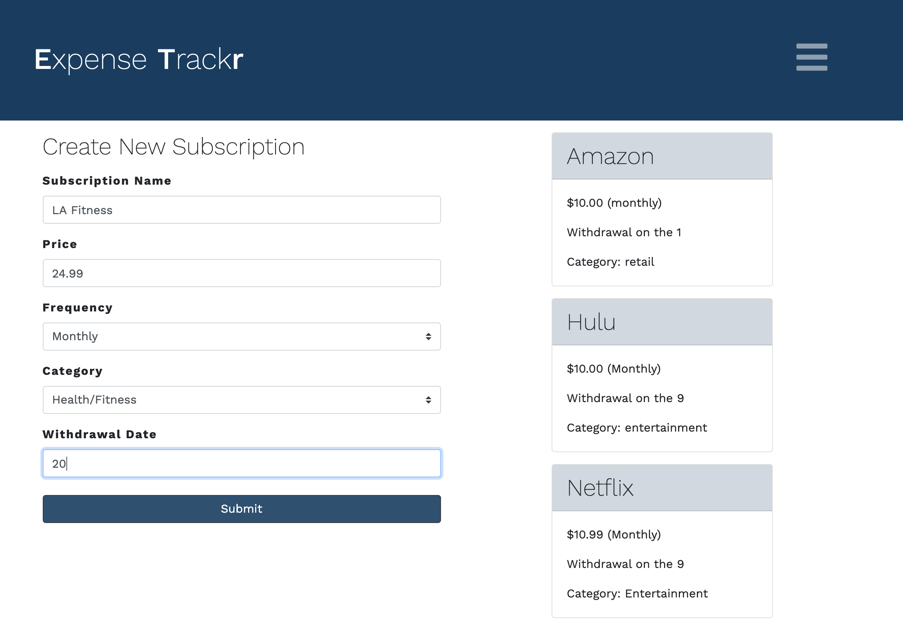

# Monthly Expense Management

## Deployed Application

[Monthly Expense Management](https://monthly-expense-management.herokuapp.com/)

## Description 

This full-stack web application allows users to keep track of subscriptions and other expenses, including price and payment frequency.

When the user navigates to the homepage, there will be a prompt to create a new account or log in to an existing account with a valid email and password. Once the user is logged in, they will have the ability to add a new subscription by including the name, price, frequency, withdrawal date, and category of that expense. Also, the user can view the budgets page to view subscriptions and also view or adjust the funds that have been paid and the funds that are left depending on an amount entered.

The application uses Passport to ensure that the user is authenticated before accessing any pages and rendering data associated with an email. The application can be run locally and store data through MySQL Workbench or deployed using Heroku and Heroku Postgres to store user data securely.

## Features

* Node.js back end with Express routing. 
* Written in JavaScript and jQuery. 
* Incorporates Bootstrap for responsiveness. 
* MySQL/Sequelize stores and retrieves saved items. 
* Express Handlebars support MVC Pattern. 
* ESLint is used to maintain consistency in coding patterns.
* Database credentials are stored as .env variables for security.

## Credits

Michael Hanson
* michaeledwardhanson@gmail.com
* [GitHub](https://github.com/mhans003)
* [LinkedIn](https://www.linkedin.com/in/michaeledwardhanson/)

Alejandra Reyes
* areye022@gmail.com
* [GitHub](https://github.com/areye022)
* [LinkedIn](https://www.linkedin.com/in/alejandrareyes022/)

Hao Lam
* hao09@yahoo.com
* [GitHub](https://github.com/mhans003)
* [LinkedIn](https://www.linkedin.com/in/hao-lam-0ba9744a/)

Thomas Mitchell
* 
* [GitHub](https://github.com/mitch-t)
* [LinkedIn]()

Joseph Kim
* 
* [GitHub](https://github.com/jkjoeeekim)
* [LinkedIn]()

## License 

Licensed under the [MIT License](./LICENSE.txt).